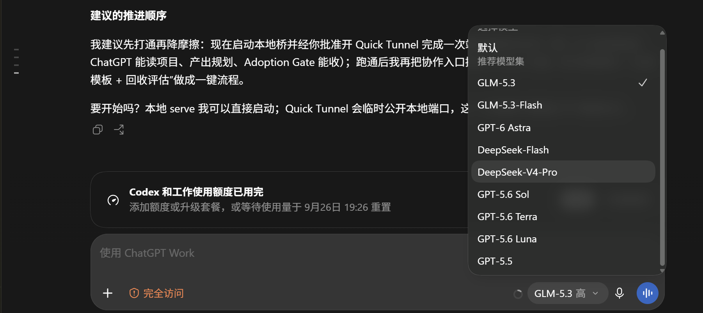

# AnyCodex


> **English TL;DR** — Mix official OpenAI models with third-party models from your own API keys *inside the same model picker* of the ChatGPT desktop app (Codex). GLM and DeepSeek come preset; any vendor that speaks the OpenAI **Responses** protocol plugs in with one config block. A ~300-line stdlib-only local router passes official traffic through with your ChatGPT login untouched. No environment switching, no third-party tools, fully reversible. [中文介绍见下 ↓](#效果)

**在 ChatGPT 桌面版的 Codex 里，官方模型与任意第三方模型（GLM、DeepSeek、Kimi……）同一个选择器混选、点谁走谁。**

如果你的 ChatGPT 套餐额度不够用，手里又有任意厂商的 API Key——[GLM Coding Plan](https://bigmodel.cn)、[DeepSeek](https://platform.deepseek.com)，或任何支持 OpenAI Responses 协议的服务——这个项目让你在**不放弃官方模型和账号能力**的前提下，把它们直接加进 Codex 右下角的模型选择器。

- 官方模型照常用（消耗你的 ChatGPT 套餐）
- 第三方模型走你自己的 API Key（比 ChatGPT 套餐便宜得多）
- 零第三方工具依赖：核心是一个数百行、无任何 pip 依赖的 Python 本地路由
- 不绑定厂商：GLM / DeepSeek 只是预置模板，加新厂商 = 照抄一个配置块

> 仅需 Python 3.11+。已在 Windows 实测；macOS/Linux 路由核心为纯 Python，可参考 [手动安装](#其他系统)。

---

## 效果

右下角选择器里，官方模型与第三方模型并列（顶部横幅为官方额度耗尽提示，此时第三方模型照常可用）：



```
GPT-6-Astra / GPT-5.6-Sol / GPT-5.6-Terra ...   ← 官方，走你的 ChatGPT 套餐
GLM-5.3 / GLM-5.3-Flash                          ← 智谱 Coding Plan（预置）
DeepSeek-Flash / DeepSeek-V4-Pro                 ← DeepSeek API（预置）
…任意厂商，照抄配置块即加                          ← 你的 Key，你的模型
```

选谁就走谁：按模型名前缀分流——`glm*` 转发智谱、`deepseek*` 转发 DeepSeek（均为预置），其他厂商在 [添加任意厂商](#添加任意厂商) 补一个配置块即可。唯一要求：厂商原生支持 OpenAI **Responses** 协议。其余请求原样透传到 OpenAI 官方后端并携带你自己的 ChatGPT 登录态。

## 原理

Codex 引擎是"全局单一供应商"设计，模型目录里没有供应商字段——这就是为什么官方路径做不到多厂商混选。AnyCodex 用四层机制绕开它：

```
ChatGPT 桌面版（官方登录态，不做任何修改）
      │ 所有模型请求
      ▼
config.toml：全局供应商指向本机路由（bearer-token 形态）
      ▼
codex_router.py（127.0.0.1:8231，按请求体里的 model 字段分流）
      ├─ glm*      → open.bigmodel.cn/api/v1     （智谱 Key，预置）
      ├─ deepseek* → api.deepseek.com            （DeepSeek Key，预置）
      ├─ 其他前缀   → 你在配置里声明的任意厂商
      └─ 未匹配     → chatgpt.com/backend-api/codex（透传你的 ChatGPT JWT，经系统代理）
```

1. **凭证注入（免切换的关键）**：供应商声明为普通 bearer-token 形态（`experimental_bearer_token`），官方请求的 ChatGPT 凭证由路由器从 `~/.codex/auth.json` 读取并注入（`Authorization` + `chatgpt-account-id`，每次请求重读，跟随应用刷新）。官方模型行为与原生一致（实测 429/200 响应与官方直连完全相同）。这一设计同时让新版桌面应用在官方额度耗尽时**不再锁定输入框**（见已知问题）。
2. **按请求分流**：供应商成为模型名的纯函数，从机制上杜绝"界面选 A、请求发给 B"。
3. **模型目录**（`models.json`）：向引擎声明第三方模型的元数据（上下文窗口、推理档位等），字段经引擎严格校验。
4. **选择器缓存注入**：桌面端选择器的底表来自服务器下发的账号模型清单（`models_cache.json`），路由器内置监视线程在应用每次刷新该缓存后，自动把自定义模型追加进去——这是第三方模型出现在选择器里的关键。

## 前置条件

- ChatGPT 桌面版（已登录，Codex 可正常使用）
- Python 3.11+（仅需标准库）
- 任意厂商的 API Key：预置 [GLM Coding Plan](https://bigmodel.cn) 与 [DeepSeek](https://platform.deepseek.com)（可任选其一或都要）；其他厂商见 [添加任意厂商](#添加任意厂商)
- 如果 cc-switch 等工具正在接管你的 `~/.codex/config.toml`，先用它还原为官方配置再安装（本工具与"切换器"类工具不兼容，因为它需要常驻供应商）

## 安装

```bash
git clone https://github.com/GinoPan/anycodex.git
cd anycodex
python setup.py
```

安装器会交互式完成：选择厂商 → 填 Key（环境变量里有则自动识别）→ 备份并修改 `~/.codex/config.toml` → 生成模型目录 → 启动路由并注册开机自启。

**最后一步：完全退出并重启 ChatGPT 桌面版**（选择器在启动时加载一次）。

## 使用须知

- **第三方模型请在新对话中使用**，或对旧对话使用"总结上下文，新开窗口继续"。引擎会把供应商钉死在会话创建那一刻——在路由配置之前创建的旧对话里原地切第三方模型会被官方后端拒绝（`not supported when using Codex with a ChatGPT account`）。新对话里官方/第三方随便切。
- 打开选择器太快时第三方模型可能还没注入完（应用启动刷新缓存后约 2 秒内补上），重开一下选择器即可。
- 官方模型报 429 是你的 ChatGPT 套餐额度用完，与本工具无关。
- 修改 `router_config.json`（换 Key、加模型）后重启路由进程即可；改了模型目录相关内容需重启应用。

## 添加任意厂商

AnyCodex 不绑定厂商，GLM / DeepSeek 只是预置模板。加新厂商：编辑 `router_config.json`（或 `~/.codex/router_config.json`），照抄一个 vendor 块改四个字段：`match_prefixes`（模型名前缀）、`host`、`path_prefix`（Responses 端点路径）、Key；`models` 里按模板补模型元数据。重启路由生效。

> 唯一硬性要求：厂商必须原生支持 OpenAI **Responses** 协议才能直连。只有 chat completions 接口的厂商需要在路由里加一层协议翻译（欢迎 PR）。

## 配置模式与切换

一条命令在两种形态间切换（改完**完全重启** ChatGPT 桌面版生效）：

```bash
python profile.py mixed      # 默认。官方+第三方混选（本地路由），官方额度可用时的完整体验
python profile.py glm        # 直连 GLM：官方额度耗尽时也能正常使用（见下方已知问题）
python profile.py deepseek   # 直连 DeepSeek：同上
python profile.py official   # 还原纯官方配置
```

### 已知问题：官方额度耗尽时，新版桌面应用会锁定输入框（含第三方模型）

2026-09-24 起的 ChatGPT 桌面版在账号官方额度（周配额）耗尽时，会在界面层静默禁用整个输入框——但**仅当活跃供应商为 ChatGPT 登录态**（`requires_openai_auth`）时才启用该锁定。AnyCodex 自本版本起将 ROUTER 供应商声明为普通 bearer-token 形态、凭证改由路由器注入，**混选模式天然不受该锁定影响**：官方额度耗尽时选择器照常混选、点谁走谁（官方模型会正常提示额度不足，第三方模型照常工作）。

旧版安装（`requires_openai_auth = true` 的 ROUTER 块）如遇输入框锁定：重跑 `python setup.py`，或手动把该行改为 `experimental_bearer_token = "anycodex-local"` 后重启应用。`codex` CLI 与直连 profile（`glm` / `deepseek`）亦不受影响。

## 排障

一切看日志：`~/.codex/router.log`（每个请求的模型、路由、状态码）。

| 现象 | 处理 |
|------|------|
| 第三方模型不出现在选择器 | 确认路由在运行（端口 8231）；看日志有无 `models_cache injected`；重启应用后等 2 秒再开选择器 |
| 官方模型从选择器消失 | 多为你的 ChatGPT/Codex 配额耗尽（服务器列表通道随限流失效）。本工具的本地目录会把官方模型兜底显示出来；使用时会正常提示配额限制，重置后恢复 |
| 第三方模型报 "not supported ... ChatGPT account" | 你在路由配置之前创建的旧对话里用了第三方模型——新开对话或用新开窗口流程 |
| 所有模型都失败 | 路由没在运行：运行 `python setup.py` 的第 4 步或手动 `pythonw ~/.codex/codex_router.py` |
| 官方模型 429 | ChatGPT 套餐额度，等重置 |
| 官方额度耗尽后，选任何模型点发送都无反应、无报错 | 旧版安装的登录态供应商触发了新版应用的输入框锁定（见「配置模式与切换」）：重跑 `python setup.py` 升级为凭证注入模式，或临时切 `python profile.py glm` |
| 改了配置不生效 | 引擎不热加载：重启 ChatGPT 桌面版 |

## 卸载

```bash
python uninstall.py
```

自动停止路由、移除自启、把 `config.toml` 恢复为官方供应商。安装时的备份文件（`config.toml.bak-anycodex-*`）会保留。

## 其他系统

Windows 为实测平台。macOS/Linux 上路由核心相同（`codex_router.py` 为纯标准库 Python），但 `setup.py` 的系统代理检测与自启动注册仅实现了 Windows——macOS 用户可手动执行等效步骤（启动路由 + 在 config.toml 加 provider 块 + 生成 models.json），欢迎 PR 补全。

## 免责声明

本项目按"现状"提供，仅供学习与个人使用。它修改的是 OpenAI 官方文档公开支持的 Codex 自定义供应商配置（`model_providers`、`model_catalog_json`），并对应用自身维护的本地缓存文件做追加式修改；不逆向、不破解、不绕过任何付费。但应用更新可能改变内部行为导致失效，使用风险自负。与 OpenAI、智谱、DeepSeek 无任何关联。

## 致谢

思路受 [cc-switch](https://github.com/farion1231/cc-switch)、[opencodex](https://github.com/lidge-jun/opencodex) 等项目与智谱 / DeepSeek 官方 Codex 接入文档启发。本项目的差异点：不切换环境、不替换供应商，官方与第三方在同一选择器中共存。
