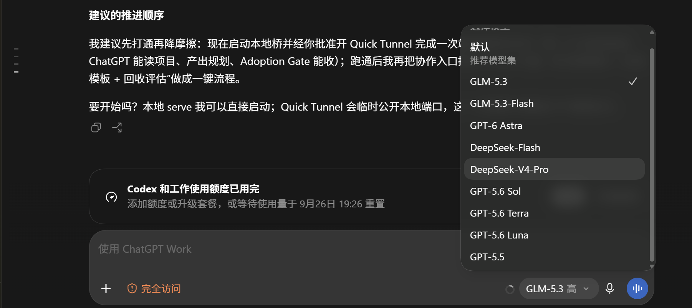

# AnyCodex


> **English TL;DR** — Mix official OpenAI models with third-party models from your own API keys *inside the same model picker* of the ChatGPT desktop app (Codex). GLM and DeepSeek come preset; any vendor that speaks the OpenAI **Responses** protocol plugs in with one config block. A ~300-line stdlib-only local router passes official traffic through with your ChatGPT login untouched. No environment switching, no third-party tools, fully reversible. [中文介绍见下 ↓](#效果)

**在 ChatGPT 桌面版的 Codex 里，官方模型与任意第三方模型（GLM、DeepSeek、Kimi……）同一个选择器混选、点谁走谁。**

如果你的 ChatGPT 套餐额度不够用，手里又有任意厂商的 API Key——[GLM Coding Plan](https://bigmodel.cn)、[DeepSeek](https://platform.deepseek.com)，或任何支持 OpenAI Responses 协议的服务——这个项目让你在**保留官方登录态、菜单和模型选择器**的前提下，把它们直接加进 Codex 右下角的模型选择器。

- 官方模型照常用（消耗你的 ChatGPT 套餐）
- 第三方模型走你自己的 API Key（比 ChatGPT 套餐便宜得多）
- 零第三方工具依赖：核心是一个数百行、无任何 pip 依赖的 Python 本地路由
- 不绑定厂商：GLM / DeepSeek 只是预置模板，加新厂商 = 照抄一个配置块

> 仅需 Python 3.11+。已在 Windows 实测；macOS/Linux 路由核心为纯 Python，可参考 [手动安装](#其他系统)。

---

## 效果

右下角选择器里，官方模型与第三方模型并列（顶部横幅为官方额度耗尽提示；左下角账户菜单仍然显示；额度耗尽时菜单中的在线功能是否可用取决于官方服务）：



```
GPT-6-Astra / GPT-5.6-Sol / GPT-5.6-Terra ...   ← 官方，走你的 ChatGPT 套餐
GLM-5.3 / GLM-5.3-Flash                          ← 智谱 Coding Plan（预置）
DeepSeek-Flash / DeepSeek-V4-Pro                 ← DeepSeek API（预置）
…任意厂商，照抄配置块即加                          ← 你的 Key，你的模型
```

选谁就走谁：按模型名前缀分流——`glm*` 转发智谱、`deepseek*` 转发 DeepSeek（均为预置），其他厂商在 [添加任意厂商](#添加任意厂商) 补一个配置块即可。唯一要求：厂商原生支持 OpenAI **Responses** 协议。其余请求原样透传到 OpenAI 官方后端并携带你自己的 ChatGPT 登录态。

## 原理

Codex 引擎是"全局单一供应商"设计，模型目录里没有供应商字段——这就是为什么官方路径做不到多厂商混选。AnyCodex 用以下机制实现混选：

```
ChatGPT 桌面版（官方登录态，不做任何修改）
      │ 所有模型请求
      ▼
config.toml：全局供应商指向本机路由（保留 ChatGPT 登录态）
      ▼
anycodex_supervisor.py（随 Windows 登录启动，路由退出后自动重启）
      ▼
codex_router.py（127.0.0.1:8231，按请求体里的 model 字段分流）
      ├─ glm*      → open.bigmodel.cn/api/v1     （智谱 Key，预置）
      ├─ deepseek* → api.deepseek.com            （DeepSeek Key，预置）
      ├─ 其他前缀   → 你在配置里声明的任意厂商
      └─ 未匹配     → chatgpt.com/backend-api/codex（透传你的 ChatGPT JWT，经系统代理）
```

1. **凭证透传（保留菜单的关键）**：供应商声明为 ChatGPT 登录态（`requires_openai_auth = true`）。官方请求优先使用引擎传来的 `Authorization` 与 `chatgpt-account-id`；只有引擎没有发送凭证时，路由器才从 `~/.codex/auth.json` 兜底读取。这也兼容凭证只保存在 Windows 凭据存储、`auth.json` 中没有令牌的安装。这一形态让桌面应用继续显示左下角账户菜单、用量入口和账号信息。
2. **按请求分流**：供应商成为模型名的纯函数，从机制上杜绝"界面选 A、请求发给 B"。
3. **动态模型清单**：Codex 请求 `GET /models` 时，路由器先获取最新官方清单，再合入第三方模型的元数据（上下文窗口、推理档位等）。官方模型的顺序、可见性、默认项和能力保持原样；第三方模型按当前官方元数据结构生成。安装器不再设置 `model_catalog_json`，也不再生成固定的 `models.json`，官方新模型与退役信息继续按 Codex 自身的缓存刷新节奏生效。
4. **选择器缓存兜底**：路由器还会向 `models_cache.json` 追加或更新第三方模型；不改官方条目，也不延长缓存有效期。在线刷新时清单已在返回前合并，避免应用读完官方清单后，第三方模型才被后台线程补上的时序问题。
5. **常驻与自恢复**：Windows 启动目录中的 `AnyCodex Router.lnk` 启动监督进程；监督进程占用 8232 端口作为单实例锁，并在 8231 路由进程意外退出时自动重启。这样应用不会因为本地路由未启动而一直显示 `Connecting…`。

## 前置条件

- ChatGPT 桌面版（已登录，Codex 可正常使用）
- Python 3.11+（仅需标准库）
- 任意厂商的 API Key：预置 [GLM Coding Plan](https://bigmodel.cn) 与 [DeepSeek](https://platform.deepseek.com)（可任选其一或都要）；其他厂商见 [添加任意厂商](#添加任意厂商)
- 如果 cc-switch 等工具正在接管你的 `~/.codex/config.toml`，先用它还原为官方配置再安装（本工具与"切换器"类工具不兼容，因为它需要常驻供应商）

## 安装

```bash
git clone https://github.com/GinoPan/anycodex.git
cd anycodex
python setup.py
```

安装器会交互式完成：选择厂商 → 填 Key（环境变量里有则自动识别）→ 把 Key 存入 Windows 凭据管理器 → 备份并修改 `~/.codex/config.toml` → 移除旧版固定目录配置 → 安装并重启路由监督进程 → 注册登录自启。Key 不会写入 `config.toml`，安装器也会清除旧配置备份中的历史明文字段。

**最后一步：完全退出并重启 ChatGPT 桌面版**（选择器在启动时加载一次）。

### 从旧版升级：修复官方新模型缺失

旧版通过 `model_catalog_json = "~/.codex/models.json"` 固定启动目录，目录只在安装时生成；这会让之后发布的官方模型（例如 GPT‑6.1 Sol）缺席选择器。更新项目后重新运行 `python setup.py`，安装器会备份配置、移除旧版目录覆盖，并重启路由加载动态 `/models` 合并逻辑。旧 `models.json` 和备份可保留，升级后的配置不再读取它们；最后完全退出并重启桌面应用。

无需把新模型名称手动加入 `router_config.json`，也无需调用第三方模型来刷新清单。模型是否可见仍取决于官方账号权限、客户端版本和官方返回的清单。如果另有自己设置的 `model_catalog_json`，安装器会提示先解除该覆盖，并保留原文件。

## 使用须知

- **第三方模型请在新对话中使用**，或对旧对话使用"总结上下文，新开窗口继续"。引擎会把供应商钉死在会话创建那一刻——在路由配置之前创建的旧对话里原地切第三方模型会被官方后端拒绝（`not supported when using Codex with a ChatGPT account`）。新对话里官方/第三方随便切。
- 在线加载模型清单时，第三方模型会随官方清单一起返回。离线缓存兜底可能需要约 2 秒；可稍后重新打开选择器。
- 官方模型报 429 是你的 ChatGPT 套餐额度用完，与本工具无关。
- 修改 `router_config.json`（加厂商、加模型）后重新运行安装器；安装器会安全地收集 Key。改了模型目录相关内容后需重启应用。

## 添加任意厂商

AnyCodex 不绑定厂商，GLM / DeepSeek 只是预置模板。加新厂商：编辑项目里的 `router_config.json`，照抄一个 vendor 块修改 `match_prefixes`（模型名前缀）、`host`、`path_prefix`（Responses 端点路径）、`key_config_section` / `key_env`；在 `models` 里按模板补模型元数据，然后重新运行安装器，由安装器收集 Key 并写入 Windows 凭据管理器。

> 唯一硬性要求：厂商必须原生支持 OpenAI **Responses** 协议才能直连。只有 chat completions 接口的厂商需要在路由里加一层协议翻译（欢迎 PR）。

## 永久 mixed 模式

AnyCodex 只保留一种运行形态：官方模型与第三方模型始终在同一个右下角选择器中。日常切换只选模型，不运行切换脚本、不改 `config.toml`、不重启应用。`profile.py` 和直连供应商的临时配置模式已经移除。

### 尚待验证：官方额度耗尽时的桌面发送门禁

目标行为是：官方额度耗尽后，左下角菜单和右下角选择器仍然显示；选择 GLM、DeepSeek 等第三方模型即可继续发送；额度恢复后直接切回官方模型。

当前版本已经完成永久 mixed 架构和凭证透传，但**还不能宣称额度耗尽门禁已经绕过**。桌面应用使用本地 `codex app-server` 上报的 `ordinaryUsageAllowed` / `rateLimitReachedType` 状态决定是否允许发送；这个判断发生在模型请求进入路由器之前。开发时账号尚有额度，无法重现和验证耗尽状态。

为完成这一步，路由器加入了默认开启的脱敏额度诊断。它只记录额度相关的响应头和 JSON 标量，不记录对话正文、Authorization、Cookie、账号 ID 或用户 ID。下一次真实耗尽时查看 `~/.codex/router.log`：

- 若出现 `quota headers ...` 或 `quota payload ...`，可据此定位并在路由层处理额度状态。
- 若完全没有对应记录，说明额度状态只经过 app-server 的本地 RPC，而不经过 HTTP 路由；下一步必须处理 app-server/UI 的门禁，继续修改普通模型路由不会生效。

在这次真实耗尽验证完成前，本项目仍可能出现“选择第三方模型后点发送无反应”。这是当前唯一与目标行为尚未闭环的部分。

### 已知问题：混选对话切回官方模型时，官方后端严格校验历史条目（2026-09-27 起已由路由自动修复）

同一对话先用 GLM/DeepSeek 跑过几轮、再切回官方模型时，官方后端对回放的历史条目做严格 schema 校验并直接 400（首次触发 2026-09-27：`Invalid 'input[N].content': array too long ... maximum length 0`）。实测官方后端规则：`reasoning` 条目不允许携带原始思维链 `content`（只认 `summary`）；条目 id 有前缀校验（`rs`/`msg` 等），不认识的 id 按"引用已存储条目"处理、`store=false` 下直接 404。而第三方轮次恰好产生这些形状：思维链放在 `content`、id 为各家自造（UUID / `msg_resp_*` / `fc_call_*`）。

路由器现已在**官方路由**上自动归一化输入：vendor 思维链转为 `summary_text` 条目（官方模型可读，保留上下文）、剥离 vendor id 与透传字段、保留 `call_id` 配对；官方自产的 reasoning（Fernet `encrypted_content` 开头 `gAAAA` + `rs` id）原样放行。实测同一混选对话归一化后官方返回 200。第三方路由不受影响（原样透传）。

## 排障

请求日志在 `~/.codex/router.log`（每个请求的模型、路由、状态码），启动和自动重启日志在 `~/.codex/router-supervisor.log`。访问 `http://127.0.0.1:8231/healthz` 可检查路由是否存活。

| 现象 | 处理 |
|------|------|
| 第三方模型不出现在选择器 | 确认路由在运行（端口 8231）；看日志有无 `models response merged` 或 `models_cache injected/updated`；确认没有 `model_catalog_json` 覆盖；重启应用 |
| 新发布的官方模型缺失 | 旧版固定目录可能滞后：更新项目并重新运行 `python setup.py`，再完全重启应用。若仍缺失，检查客户端版本和账号权限；保留官方服务器返回的可见性 |
| 官方清单刷新失败 | 先看路由日志的 `/models` 状态码；Codex 可使用自身缓存，AnyCodex 不伪造账号权限或强行显示服务器隐藏的模型 |
| 第三方模型报 "not supported ... ChatGPT account" | 你在路由配置之前创建的旧对话里用了第三方模型——新开对话或用新开窗口流程 |
| 应用一直显示 `Connecting…`，所有模型都失败 | 先访问 `http://127.0.0.1:8231/healthz`；打不开时重新运行 `python setup.py`，并确认 Windows 启动目录存在 `AnyCodex Router.lnk`。不要只手动启动单个 `codex_router.py` |
| 官方模型 429 | ChatGPT 套餐额度，等重置 |
| 官方额度耗尽后，点发送无反应、无报错 | 查看 `~/.codex/router.log` 中的 `quota headers` / `quota payload` 诊断；当前版本尚待一次真实耗尽状态完成门禁定位与验证 |
| 改了配置不生效 | 引擎不热加载：重启 ChatGPT 桌面版 |

## 卸载

```bash
python uninstall.py
```

自动停止路由、移除自启、把 `config.toml` 恢复为官方供应商。安装时的备份文件（`config.toml.bak-anycodex-*`）会保留。

## 其他系统

Windows 为实测平台。macOS/Linux 上路由核心相同（`codex_router.py` 为纯标准库 Python），但 `setup.py` 的系统代理检测与自启动注册仅实现了 Windows——macOS 用户可手动执行等效步骤（安装路由及 `anycodex_models.py` 等依赖模块、配置 Key 环境变量、在 config.toml 加 provider 块并启动路由；不要设置 `model_catalog_json`），欢迎 PR 补全。

## 验证

```bash
python -m unittest test_router test_models -v
```

覆盖模型清单更新、官方条目和缓存有效期保持、第三方元数据更新、HTTP 合并与凭证透传、旧版配置迁移及重复安装/卸载。可用 `ANYCODEX_TEST_CODEX_BINARY` 指定桌面应用内置 `codex.exe` 的绝对路径，再运行同一命令，追加真实客户端的发现检查。该检查使用临时配置和本地模拟清单，不调用模型生成接口。

## 免责声明

本项目按"现状"提供，仅供学习与个人使用。它使用 Codex 自定义供应商配置（`model_providers`），对官方模型清单追加第三方条目，并对应用自身维护的本地缓存做追加式修改；不逆向、不破解、不绕过任何付费。官方文档将 `model_catalog_json` 定义为[启动时加载的目录覆盖](https://learn.chatgpt.com/docs/config-file/config-sample)；本项目已移除该覆盖，以保持官方模型发现更新。应用更新可能改变内部行为导致失效，使用风险自负。与 OpenAI、智谱、DeepSeek 无任何关联。

## 致谢

思路受 [cc-switch](https://github.com/farion1231/cc-switch)、[opencodex](https://github.com/lidge-jun/opencodex) 等项目与智谱 / DeepSeek 官方 Codex 接入文档启发。本项目的差异点：不切换环境、不替换供应商，官方与第三方在同一选择器中共存。
